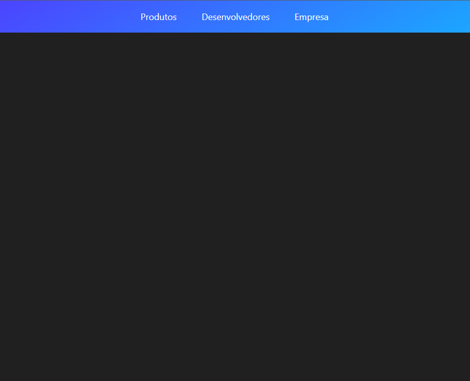

<h1 align="center">
    
</h1>

<h1 align="center">
    
</h1>

<h2 align="center">Reprodução da navbar do site Stripe.com.</h2>

<h3><strong>:satellite:Tecnologias utilizadas:</strong></h3>

<h3>ReactJS  </h3>
<h3>Frame Motion  </h3>

Obs: Foram utilizadas os seguintes hooks do ReactJS 

<ul>
<li>useCallback</li>
<li>useLayoutEffect</li>
<li>useRef</li>
<li>useState</li>
<li>useContext</li>
<li>useEffect</li>
<li>useMemo</li>
</ul>

<h4>Entenda porque essa navbar é tão complexa acessando o vídeo da Rocketseat abaixo: </h4>
<a href="https://www.youtube.com/watch?v=B7V0q0ZSz2o&t=7200s" target="_blank">Vídeo</a>

---

### Instalando aplicação

Execute o comando ```npm install``` na raiz da pasta para instalar as dependências.

Após executado o código acima, execute o comando ```npm start```.

<h4>Dúvidas entre em contato pelo <a href="https://www.linkedin.com/in/marco-antonio-monteiro-de-brito-541ba0144/" target="_blank">Linkedin</a> </h4>

<h4 align="center"> <em>&lt;/&gt;</em> by <a href="https://github.com/marcomonteirobrito" target="_blank">marcomonteirobrito</a> </h4>